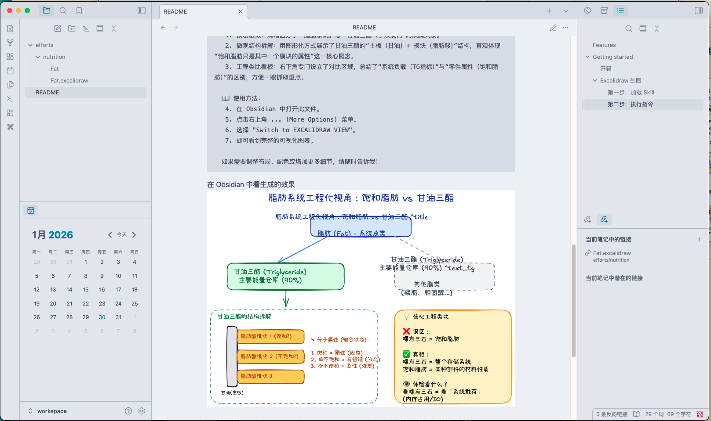

Vault as workspace for thinking and creation.


## Features
1. 适配开发模式的 Obsidian 配置
2. 集成 Obsidian 常用插件
3. 集成设计常用的 Obsidian Skills

## Getting started

### 开箱
开箱即用的 Obsidian 仓库
1. 克隆仓库
2. 打开仓库
3. 创建项目

### Excalidraw 生图
Gemini CLI Skills: https://geminicli.com/docs/cli/skills/

#### 第一步，加载 Skill
Gemini CLI 0.26.0 已经内置了 `/Skills` 命令，可以直接把仓库 Skills 拷贝到本地然后直接激活：

拷贝仓库中的 Skills
```bash
$ cp -r .skills/* ~/.gemini/skills
```

在 Gemini CLI 中激活
```
> /skills reload
✓ Agent skills reloaded successfully. 1 newly available skill.

> /skills list

Available Agent Skills:

  - excalidraw-diagram
      Generate Excalidraw diagrams from text content for Obsidian. Use when user asks to create diagrams, flowcharts, mind maps, or visual representations in Excalidraw format. Triggers on "Excalidraw", "画图", "流程图", "思维导图", "可视化", "diagram".
```

#### 第二步，执行指令
```
> @efforts/nutrition/Fat.md 可视化
│ ✓  Activate Skill "excalidraw-diagram": Generate Excalidraw diagrams from text content for Obsidian. 
│ ✓  WriteFile Writing to efforts/.../Fat.excalidraw.md
✦ ✅ Excalidraw 图已自动生成！

  📍 保存位置：
  efforts/nutrition/Fat.excalidraw.md

  🎨 图表设计说明：
  为了清晰展示“饱和脂肪”与“甘油三酯”的工程化关系，我设计了一个混合型结构图：
   1. 顶层层级：清晰区分了「脂肪系统」与「甘油三酯（子系统）」的从属关系。
   2. 微观结构拆解：用图形化方式展示了甘油三酯的“主板（甘油）+ 模块（脂肪酸）”结构，直观体现“饱和脂肪只是其中一个模块的属性”这一核心概念。
   3. 工程类比看板：右下角专门设立了对比区域，总结了“系统负载（TG指标）”与“零件属性（饱和脂肪）”的区别，方便一眼抓取重点。

  📖 使用方法：
   4. 在 Obsidian 中打开此文件。
   5. 点击右上角 ... (More Options) 菜单。
   6. 选择 "Switch to EXCALIDRAW VIEW"。
   7. 即可看到完整的可视化图表。

  如果需要调整布局、配色或增加更多细节，请随时告诉我！
```

在 Obsidian 中看生成的效果
![[Fat.excalidraw|1000]]
